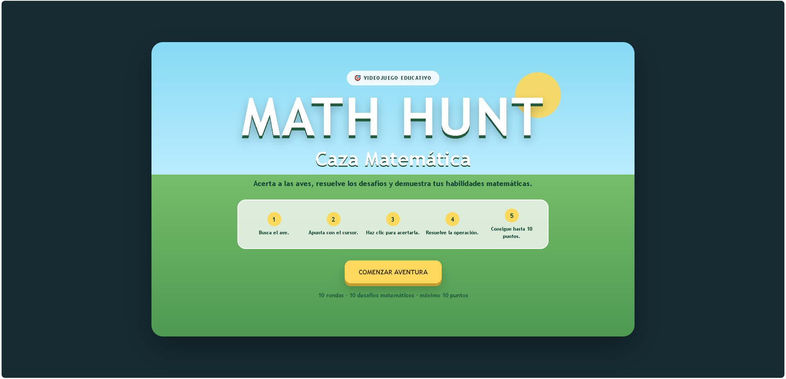
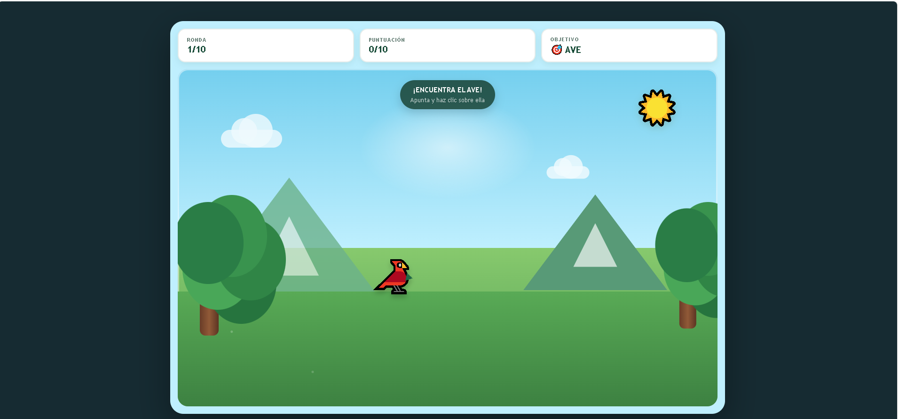

# 🎮 Math Hunt: Caza Matemática
 
## Descripción
**Math Hunt: Caza Matemática** es un videojuego educativo diseñado para ayudar a estudiantes de primer año de secundaria a practicar operaciones aritméticas mediante una experiencia interactiva y entretenida de puntería.
El jugador toma el rol de un explorador en una cacería ambientada en un entorno natural. Para avanzar por los diferentes desafíos, debe localizar y acertar a un ave que se desplaza por el escenario. Tras acertar al objetivo, se desbloquea una operación matemática que deberá resolver correctamente para sumar puntos y completar la aventura.
El proyecto combina la mecánica clásica de puntería con actividades educativas dinámicas para potenciar el aprendizaje de la matemática.
 
##  Objetivo del jugador
El objetivo principal es completar las 10 rondas del juego, acertar a los objetivos en movimiento y resolver correctamente las operaciones aritméticas propuestas para obtener una puntuación máxima de 10 puntos.
 
### Objetivos específicos
* Apuntar y acertar a las aves que aparecen en el escenario en cada ronda.
* Resolver correctamente las operaciones de suma, resta, multiplicación, división y operaciones combinadas.
* Evitar cometer errores para mantener la puntuación máxima.
* Visualizar la corrección inmediata en caso de fallo para reforzar el aprendizaje.
* Completar las 10 rondas y obtener la mejor calificación de desempeño posible.
 
 
##  Mecánica principal
La mecánica principal del videojuego combina la puntería interactiva con la resolución de problemas educativos:
 
1. **Fase de Caza:** En cada ronda aparece un ave en una posición aleatoria moviéndose por la pantalla. El jugador mueve el cursor (transformado en mira) y hace clic sobre el ave.
2. **Fase de Desafío:** Tras acertar al objetivo, la animación del ave se detiene y se despliega una interfaz con una pregunta matemática y 4 opciones de respuesta.
3. **Fase de Feedback:** El jugador selecciona una respuesta. El sistema evalúa la opción, otorga el punto correspondiente (si es correcta) o muestra la respuesta adecuada (si es incorrecta) antes de permitir pasar a la siguiente ronda.
 
El videojuego busca combinar:
* Puntería y precisión con el mouse.
* Resolución de problemas matemáticos.
* Progresión por rondas y velocidades.
* Recompensas y retroalimentación inmediata.
 
##  Género
**Educational / Target Shooter / Quiz / Platformer-Inspired**  
El proyecto fusiona elementos de juegos clásicos de tiro al blanco con dinámicas educativas de preguntas, respuestas y retroalimentación directa.
 
 
## 🎮 Controles
 
Elemento   Acción                 Función
 
**MOUSE / MIRA**       Mover el cursor sobre el escenario para apuntar al ave. 
**CLICK IZQUIERDO**    Disparar/acertar al ave y seleccionar las alternativas de respuesta. 
**PANTALLA / BOTONES** Interactuar con los controles de la interfaz (*Comenzar Aventura*, *Siguiente Ronda*, *Jugar de Nuevo*).
 
>  *Los controles están adaptados para funcionar en computadoras, laptops y tablets mediante interfaz táctil o cursor.*
 
 
##  Tecnologías utilizadas
El videojuego fue desarrollado utilizando exclusivamente tecnologías web estándar (sin librerías ni servidores externos):
 
* **HTML5:** Estructura semántica del juego y contenedores de la interfaz.
* **CSS3:** Estilos visuales, animaciones, cursor personalizado en forma de mira y responsive design.
* **JavaScript (Vanilla):** Lógica del juego, movimiento de objetivos, validación de respuestas, sistema de puntaje y sonidos sintetizados.
* **Visual Studio Code:** Entorno de desarrollo.
* **Git & GitHub / GitHub Pages:** Control de versiones y publicación en web.
 
 
##  Capturas de pantalla
 
###  Pantalla inicial
*(Espacio reservado para la captura de la pantalla principal con el título "MATH HUNT: CAZA MATEMÁTICA", las instrucciones de juego y el botón COMENZAR AVENTURA)*
 

 
 
###  Gameplay (Fase de Caza y Desafío Matemático)
*(Espacio reservado para las capturas del escenario natural con el ave en movimiento y la ventana pop-up con la operación matemática y sus 4 alternativas)*
 
 

 
###  Resultado
*(Espacio reservado para la captura de la pantalla final con la puntuación acumulada sobre 10, el mensaje de desempeño y el botón JUGAR DE NUEVO)*
 
 

 
##  Jugar
🎮 **Jugar Math Hunt: Caza Matemática**  
▶️ **[JUGAR AHORA](https://patrick145-maker.github.io/game-development-portfolio/Aventura-Matematica/)** *(Enlace configurable a GitHub Pages)*
 
El videojuego puede ejecutarse directamente abriendo el archivo `index.html` en cualquier navegador web moderno sin necesidad de instalar programas adicionales.
 
 
## 🤖 Uso de Inteligencia Artificial
Durante el desarrollo del proyecto se aplicó una metodología asistida por **Inteligencia Artificial Generativa** como apoyo técnico e instructivo.
 
La inteligencia artificial fue utilizada para:
* **Generación del Prototipo Inicial:** Creación de la estructura HTML, CSS y lógica JS a través de un prompt detallado.
* **Diseño de Mecánicas:** Integración fluida entre la captura del objetivo y la activación de la pregunta.
* **Validador Matemático:** Revisión de la jerarquía de operaciones y coherencia en las respuestas planteadas.
* **Optimización y Debugging:** Refactorización del código para corregir fallos en la detección de clics y cálculo del puntaje final.
* **Documentación:** Formateo y organización técnica de la guía de práctica.
 
*(El código generado fue validado y probado manualmente para comprobar el cumplimiento de todos los requisitos).*
 
 
##  Lo que aprendí
Durante el desarrollo de este proyecto se consolidaron los siguientes aprendizajes:
 
* A analizar problemas educativos y transformar requisitos de clientes en mecánicas de videojuego.
* A estructurar e implementar dinámicas de puntería e interactividad con **HTML5, CSS3 y JavaScript**.
* A redactar **prompts estructurados y complejos** para guiar a las herramientas de IA en la producción de código funcional.
* A realizar pruebas iterativas (V1, V2, V3) para corregir *bugs* en el desarrollo web.
* A utilizar adecuadamente **GitHub y GitHub Pages** para alojar y desplegar videojuegos web.
* A crear y estructurar documentación técnica y profesional de proyectos de desarrollo de videojuegos.
 
 
##  Mejoras futuras
Para futuras iteraciones del prototipo se tienen contempladas las siguientes mejoras:
 
* **Variedad de Objetivos:** Incluir diferentes tipos de aves con comportamientos y trayectorias impredecibles.
* **Efectos de Audio Avanzados:** Integrar efectos de sonido reales de disparos/aciertos y música de fondo ambiental.
* **Nivel de Dificultad Dinámico:** Incorporar temporizadores o un límite de disparos por ronda.
* **Sistema de Vidas:** Implementar un límite de intentos si el ave se escapa de la pantalla.
* **Gráficos en Canvas:** Migrar el renderizado del escenario a HTML5 Canvas para mayor fluidez.
* **Tabla de Clasificación (Leaderboard):** Guardado local de las mejores marcas de los estudiantes.
 
 
##  Autor
**Ludwing Leonel Cuba Condori**  
*Estudiante de Game Development.*  
Este proyecto fue desarrollado como parte de las actividades prácticas de la asignatura *Game Development*.
 
 
##  Contexto académico
* **Asignatura:** Game Development  
* **Unidad:** Introducción al desarrollo de videojuegos  
* **Proyecto:** Math Hunt: Caza Matemática  
* **Tipo:** Prototipo de videojuego educativo asistido por IA  
