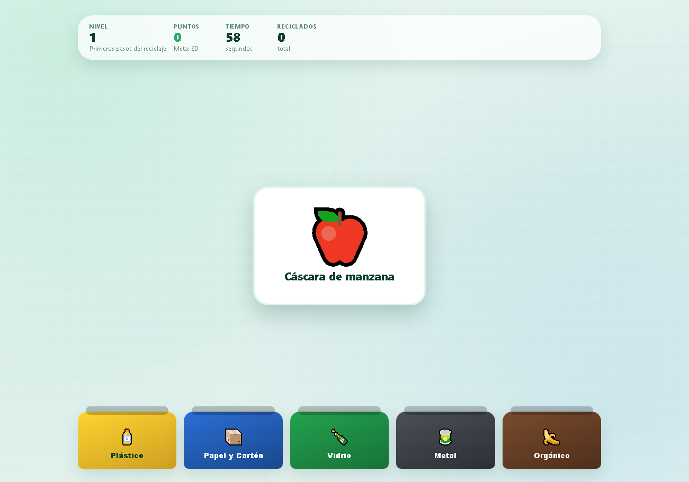
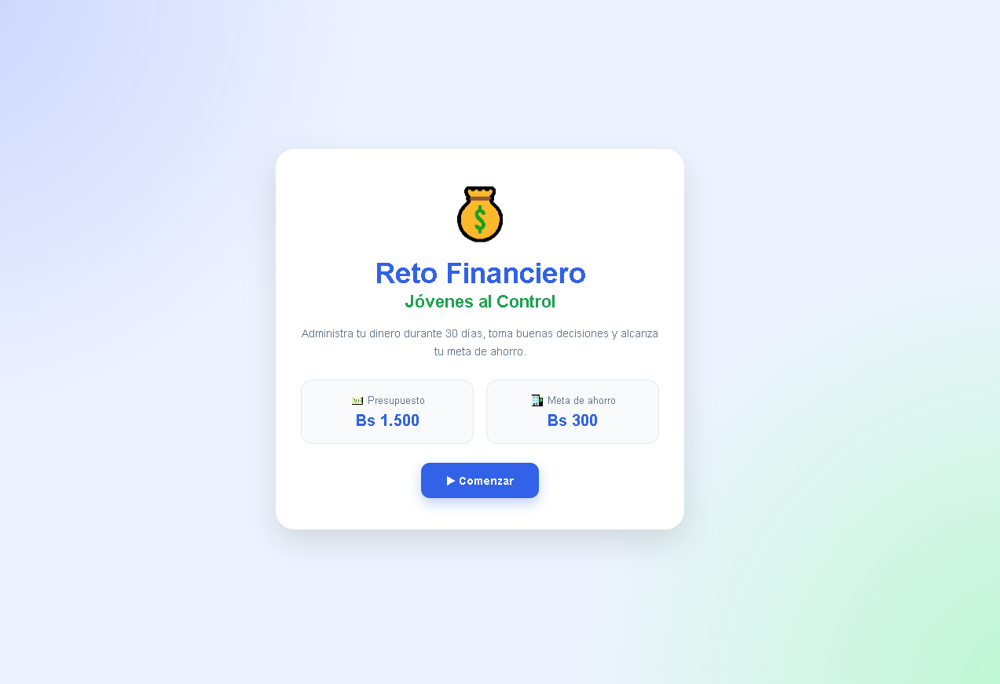
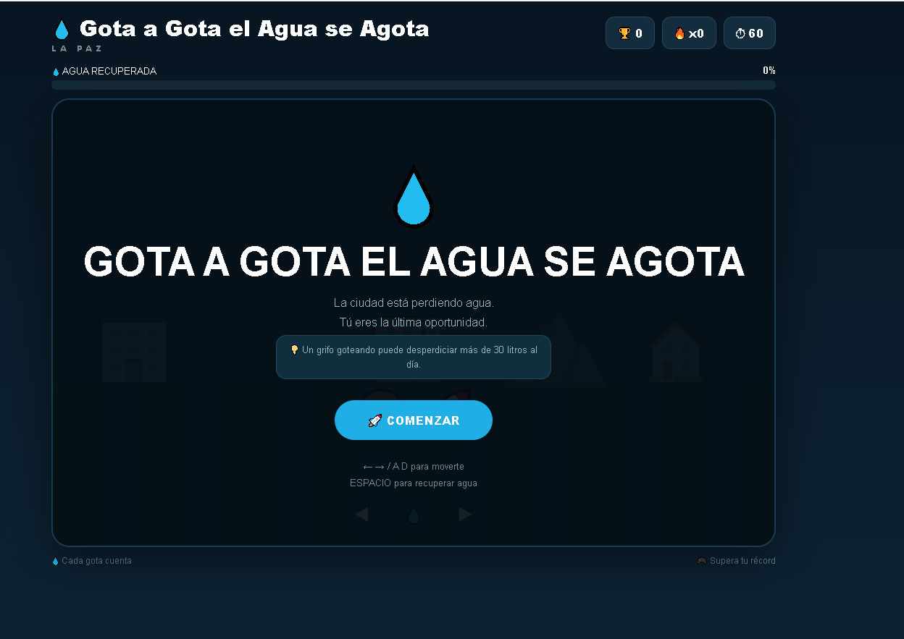
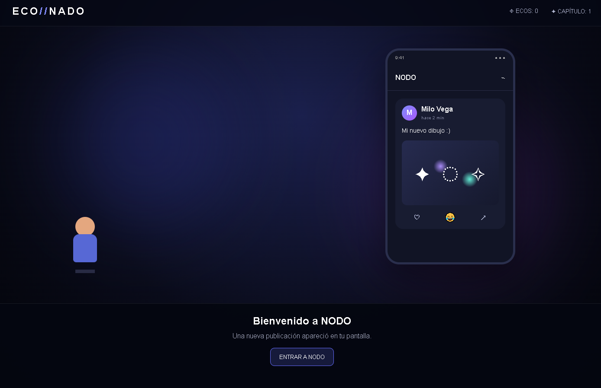
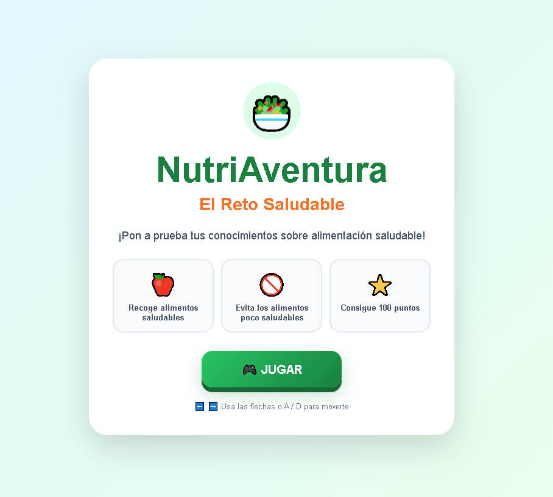

 
<h1 align="center">🎮 Game Development Portfolio</h1>
 

<strong>Dustin Fernando Vaca Aguilar</strong>

 

 
---
 
# 👨‍💻 Dustin Fernando Vaca Aguilar
 
## 🎮 Bienvenido a mi Portafolio de Game Development
 
¡Hola! Soy **Dustin Fernando Vaca Aguilar**, estudiante de **Game Development**.
 
Este repositorio reúne los videojuegos y prototipos desarrollados durante las primeras actividades de la asignatura.
 
Mi objetivo durante este proceso fue aprender a transformar diferentes ideas y problemas en experiencias interactivas mediante el diseño de mecánicas, programación, creatividad y herramientas de inteligencia artificial.
 
---
 
# 🎯 Sobre este portafolio
 
Este portafolio presenta **6 videojuegos educativos e interactivos**, desarrollados utilizando principalmente tecnologías web.
 
Cada proyecto busca abordar una temática diferente:
 
| 🎮 Proyecto | 🎯 Temática |
|---|---|
| 🎮 Aventura Matemática | Educación matemática |
| ♻️ Recycling Time 2.0 | Reciclaje |
| 💰 Reto Financiero | Educación financiera |
| 💧 Gota a Gota el Agua se Agota | Cuidado del agua |
| 🌎 ECONADO | Conciencia ambiental |
| 🥦 NutriAventura | Alimentación saludable |
 
---
 
# 🎮 Mis Videojuegos
 
## 🎮 1. Aventura Matemática: El Reino de los Números
 

 
### 📖 Descripción
 
Videojuego educativo de aventura y plataformas en el que el jugador debe superar diferentes desafíos matemáticos.
 
El objetivo es resolver operaciones correctamente mientras avanza por el mundo del juego.
 
### 🎯 Objetivo
 
Resolver los desafíos matemáticos y completar la aventura.
 
### 🕹️ Género
 
**Adventure / Platformer / Educational**
 
### 💻 Tecnología
 
- HTML5
- CSS3
- JavaScript
 
### ▶️ Jugar
 

 
---
 
# ♻️ 2. Recycling Time 2.0 — Guardianes del Reciclaje
 

 
### 📖 Descripción
 
Videojuego educativo centrado en el reciclaje.
 
El jugador debe identificar diferentes residuos y colocarlos en el contenedor correspondiente.
 
### 🎯 Objetivo
 
Clasificar correctamente los residuos para obtener la mayor puntuación y reducir la contaminación.
 
### 🕹️ Género
 
**Arcade / Educational / Simulation**
 
### 💻 Tecnología
 
- HTML5
- CSS3
- JavaScript
- Drag & Drop
 
### ▶️ Jugar
 

 
---
 
# 💰 3. Reto Financiero: Jóvenes al Control
 

 
### 📖 Descripción
 
Videojuego educativo basado en situaciones financieras cotidianas.
 
El jugador debe tomar decisiones sobre cómo utilizar su dinero, enfrentándose a situaciones tentadoras que pueden provocar gastos impulsivos.
 
### 🎯 Objetivo
 
Aprender a tomar decisiones financieras responsables mediante diferentes situaciones interactivas.
 
### 🕹️ Género
 
**Simulation / Strategy / Educational**
 
### 💻 Tecnología
 
- HTML5
- CSS3
- JavaScript
 
### ▶️ Jugar
 

 
---
 
# 💧 4. Gota a Gota el Agua se Agota
 

 
### 📖 Descripción
 
Videojuego educativo enfocado en la importancia del cuidado y conservación del agua.
 
El jugador debe superar diferentes desafíos relacionados con el uso responsable de este recurso.
 
### 🎯 Objetivo
 
Crear conciencia sobre el desperdicio del agua y promover hábitos responsables.
 
### 🕹️ Género
 
**Educational / Arcade**
 
### 💻 Tecnología
 
- HTML5
- CSS3
- JavaScript
 
### ▶️ Jugar
 

 
---
 
# 🌎 5. ECONADO
 

 
### 📖 Descripción
 
Videojuego educativo desarrollado alrededor de una temática de conciencia y educación ambiental.
 
El proyecto busca convertir el aprendizaje relacionado con el medio ambiente en una experiencia interactiva.
 
### 🎯 Objetivo
 
Promover la conciencia ambiental mediante una experiencia de videojuego.
 
### 🕹️ Género
 
**Educational / Adventure**
 
### 💻 Tecnología
 
- HTML5
- CSS3
- JavaScript
 
### ▶️ Jugar
 

 
---
 
# 🥦 6. NutriAventura
 

 
### 📖 Descripción
 
Videojuego educativo relacionado con la alimentación saludable.
 
El proyecto busca presentar conceptos relacionados con una buena alimentación mediante una experiencia interactiva.
 
### 🎯 Objetivo
 
Promover hábitos de alimentación saludable de una manera entretenida.
 
### 🕹️ Género
 
**Adventure / Educational**
 
### 💻 Tecnología
 
- HTML5
- CSS3
- JavaScript
 
### ▶️ Jugar
 

 
---
 
# 🛠️ Tecnologías utilizadas
 
Durante el desarrollo de los diferentes proyectos se utilizaron diferentes herramientas y tecnologías.
 
### 💻 Desarrollo
 
- HTML5
- CSS3
- JavaScript
 
### 🧰 Herramientas
 
- Visual Studio Code
- Git
- GitHub
- GitHub Pages
 
### 🎨 Diseño
 
- Diseño de interfaces
- Animaciones
- Elementos gráficos
- Diseño de videojuegos
 
### 🤖 Inteligencia Artificial
 
Las herramientas de inteligencia artificial fueron utilizadas como apoyo durante diferentes etapas del desarrollo.
 
---
 
# 🤖 Uso de Inteligencia Artificial
 
La inteligencia artificial fue utilizada como una herramienta de apoyo y no como sustituto del proceso creativo.
 
Se utilizó principalmente para:
 
- 💡 Generación de ideas.
- 🎮 Diseño de mecánicas.
- 💻 Apoyo en programación.
- 🐛 Identificación y corrección de errores.
- 🎨 Propuestas de diseño.
- 📝 Organización de documentación.
- 💭 Generación de alternativas para mejorar los proyectos.
 
Los resultados obtenidos mediante IA fueron revisados, modificados y adaptados al propósito de cada videojuego.
 
---
 
# 📚 Lo que aprendí
 
Durante el desarrollo de estos proyectos aprendí diferentes aspectos relacionados con Game Development.
 
### 🎮 Diseño de videojuegos
 
Aprendí a transformar una idea en una mecánica jugable y a pensar en el objetivo que debe cumplir el jugador.
 
### 💻 Programación
 
Aprendí a utilizar HTML, CSS y JavaScript para crear experiencias interactivas.
 
### 🧠 Diseño de mecánicas
 
Aprendí a trabajar con:
 
- Puntuaciones.
- Temporizadores.
- Decisiones.
- Drag & Drop.
- Eventos.
- Niveles.
- Estados del juego.
- Sistemas de recompensa y penalización.
 
### 🌐 Publicación
 
Aprendí a utilizar GitHub y GitHub Pages para publicar proyectos web y permitir que otras personas puedan probarlos.
 
### 🤖 Inteligencia Artificial
 
Aprendí a utilizar herramientas de IA como apoyo para generar ideas, solucionar problemas y mejorar diferentes partes de los proyectos.
 
---
 
# 🚀 Mejoras futuras
 
En futuras versiones de estos videojuegos me gustaría implementar:
 
- 🎵 Música y efectos de sonido.
- 🎨 Animaciones más avanzadas.
- 📱 Adaptación completa para dispositivos móviles.
- 🏆 Sistemas de logros.
- 📊 Estadísticas del jugador.
- 🥇 Rankings.
- ❤️ Sistema de vidas.
- 🎚️ Diferentes niveles de dificultad.
- 🗺️ Nuevos escenarios.
- 👥 Modo multijugador.
- 💾 Sistema de guardado.
- 🎮 Controles más avanzados.
 
---
 
